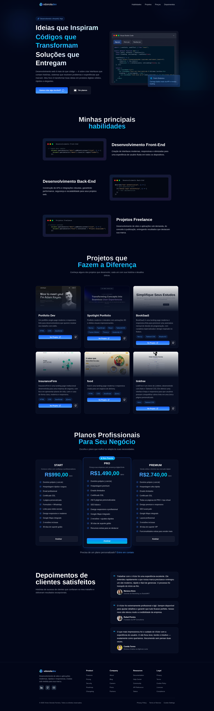

# 💻 vdonoladev — Portfólio Pessoal

Bem-vindo ao repositório oficial do meu site pessoal, desenvolvido para apresentar meu trabalho como desenvolvedor front-end e back-end freelancer.
Este projeto foi construído com **React**, **TailwindCSS** e muito cuidado nos detalhes de UI/UX — performance, responsividade e elegância são o foco aqui.

---

## 🚀 Tecnologias Principais

| Tecnologia                      | Função                                                     |
| ------------------------------- | ---------------------------------------------------------- |
| ⚛️ **React.js**                 | Framework principal para criação da interface.             |
| 🎨 **Tailwind CSS**             | Estilização rápida e responsiva.                           |
| 🧠 **React Hooks**              | Controle de estado e efeitos com `useState` e `useEffect`. |
| 💅 **Lucide React**             | Ícones vetoriais leves e modernos.                         |
| 🧩 **React Syntax Highlighter** | Exibição de blocos de código com temas escuros elegantes.  |

---

## 🌟 Destaques do Projeto

* 🧠 **Design inteligente e responsivo** — ajusta-se perfeitamente a qualquer tela.
* ✨ **Animações sutis e fluidas** — usando CSS custom e utilitários do Tailwind.
* 💬 **Contato rápido via WhatsApp** — botão direto para iniciar conversa.
* 💾 **Código limpo e modular** — fácil de manter e expandir.
* 🔍 **Foco em UX/UI** — layout inspirado em IDE, cores equilibradas e tipografia legível.

---

## 🧭 Estrutura das Seções

| Seção            | Descrição                                                       |
| ---------------- | --------------------------------------------------------------- |
| **Navbar**       | Navegação fluida com transição ao rolar a página.               |
| **Hero**         | Chamada principal, com efeito de gradiente e código interativo. |
| **Features**     | Mostra habilidades front-end, back-end e projetos freelance.    |
| **Pricing**      | Planos START, PRO e PREMIUM — todos com CTA integrado.          |
| **Testimonials** | Avaliações reais de clientes satisfeitos.                       |
| **Footer**       | Links úteis, contatos e direitos autorais.                      |

---

## ⚙️ Como Rodar Localmente

1. Clone o repositório:

   ```bash
   git clone https://github.com/vdonoladev/myPortfolio.git
   cd myPortfolio
   ```

2. Instale as dependências:

   ```bash
   npm install
   ```

3. Execute o servidor de desenvolvimento:

   ```bash
   npm run dev
   ```

4. Acesse no navegador:

   ```
   http://localhost:3000/
   ```

---

## 🖼️ Prévia do Projeto

> 💡 *A interface foi desenhada para causar impacto logo de cara — escura, moderna e com um toque futurista.*



---

## 📬 Contato

Se quiser trocar uma ideia sobre projetos, colaborações ou freelas:

* 🌐 **Site:** [vdonoladev.vercel.app](https://vdonoladev.vercel.app/)
* 💼 **LinkedIn:** [linkedin.com/in/vdonoladev](https://linkedin.com/in/vdonoladev)
* 💻 **GitHub:** [github.com/vdonoladev](https://github.com/vdonoladev)
* ✉️ **Email:** [contato.victordonolaferreira@outlook.com](mailto:contato.victordonolaferreira@outlook.com)
* 💬 **WhatsApp:** [Fale comigo](https://wa.me/5524998652938?text=Ol%C3%A1%2C%20V%C3%ADctor!)

---

## 🧠 Licença

Este projeto é de uso pessoal, mas pode servir de referência para outros devs.
Se for se inspirar, dá aquele crédito justo. 🤝

---

## 🏁 Considerações Finais

Esse site não é só um portfólio — é um **cartão de visita digital**.
Foi pensado para transmitir profissionalismo, técnica e estilo.
Cada linha de código tem um propósito: **mostrar o que faço, e fazer bem feito.**
